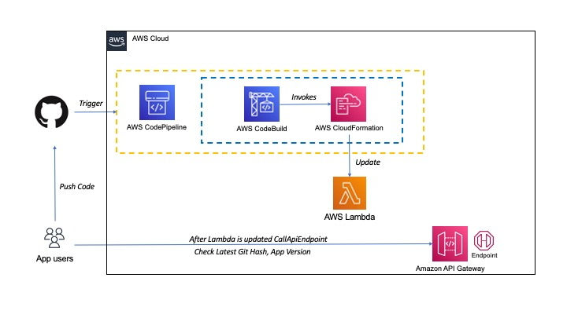

# App Health Check API - with CodePipeline
This repo is created to accomodate the code and documentation required to setup a AWS environment that provides Cloudformation templates to setup a sample API using Lambda and API Gateway to provide a JSON response containing details of the App and the Git Hash.

### Services used
- API Gateway
- Lambda
- CodePipeline
- Cloudformation

## Deployment Steps
The steps to Deploy the aws services are - 
1. Login to AWS Console and select AWS CodePipeline in the services section
2. Create a Connection to Github using the details mentioned in next section
3. Open AWS Cloudformation service and deploy the "codepipeline.yaml" while specifying correct parameters like Git Branch, s3 etc
4. The "codepipleine.yaml" invokes "cfn.yaml" in the build stage internally and creates Lambda and API gateway.
 

> ### Pre-requisites 
>For the purposes of CodePipeline a codestar connection needs to be created manually with GitHub. Steps to create the connection are available here.  https://docs.aws.amazon.com/codepipeline/latest/userguide/connections-github.html 
<b>Please take a note of the connection ARN. This will be used as a input to the CFN template that deploys the CodePipeline</b> 

### 

### Deploying CodePipeline 
Code for deploying CodePipeline is available in the `codepipeline.yaml` file. This template creates the complete pipeline to automate release of the API as changes are made to the repo. ( Repo details will be shared separately via email ). Using the repo details create the GitHub(2) connection in CodePipeline and note the arn.
Name of the Cloudformation stack `API_HEALTH_CICD`.
  Parameters as follows:
- CodePipelineBucketName: codepipeline-ap-southeast-2-xxxxxxxxxx
- CodeStarConnectionArn: arn:aws:codestar-connections:ap-southeast-2:xxxxxxxx:connection/8d554689-4597-4973-ba04-592a23a01d8f
- Environment:	Dev
- GitHubBranch:	main
- GitHubRepository:	owner/repo
 
Deploying the pipeline and triggering it, will automatically create the new CFN stack for the API Gateway and Lambda. The new stack created will be by the name `API-HEALTH-CHECK`. 

Once the `API-HEALTH-CHECK` stack is launched completely, move to the `Outputs tab` of the stack's console. You will see the API gateway URL against the key, `APIGatewayURL`.

 Clik on the link and you should receive a response similar to the following details,   `{"git_hash": "0e911cd3b58f46572683ec2f34d2cbea397f1c1d", "app_version": "1.0", "app_name": "API-HEALTH-CHECK"}` 
  We have now setup the health API succesfully. 

 

### Deploying the API Gateway ( manual launch not required )
Code for deploying the API gateway is available in the `cfn.yaml` file. This template creates an API gateway backed by a Lambda function. Name of the Cloudformation stack `API-HEALTH-CHECK`. 
Parameters as follows:
- AppName:	API-HEALTH-CHECK
- AppVersion:	1.0
- GitHash:	xxxxxx  

This stack is launched automatically as part of the pipeline.

>> Any changes made to the branch `main` will trigger a deployment and the corresponding Git commit hash can be seen in the reponse of the API. Details regarding access to the Repo will be sent via email separately.

## Steps to check latest Git hash
1. After deployment is complete, we can check the latest Git hash by calling the API Endpoint .The API Endpoint is received as a output from cloud formation stack
2. Sample API Endpoint created while deployment is - https://eh7mauqyfd.execute-api.ap-southeast-2.amazonaws.com/v0/health
2. The API endpoint sample response is - {"git_hash": "b6fa88189292cbc6c33419aca71e109b29534b59", "app_version": "1.0", "app_name": "API-HEALTH-CHECK"}

## Steps to check the latest Git hash after code is updated and pushed to Github.

1. Push the updated code to Github repository
2. The CodePipeline is automatically triggered which in turn updates the Lambda code
3. Check and verify the latest git hash, app version and app name by invoking the API Endpoint created during deployment.